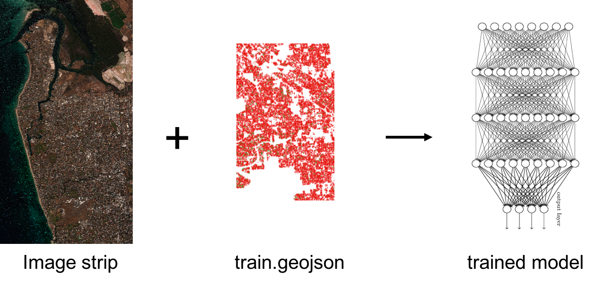
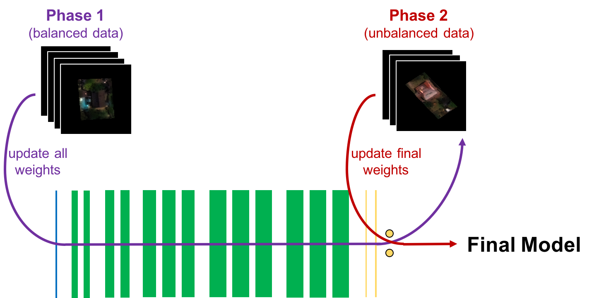
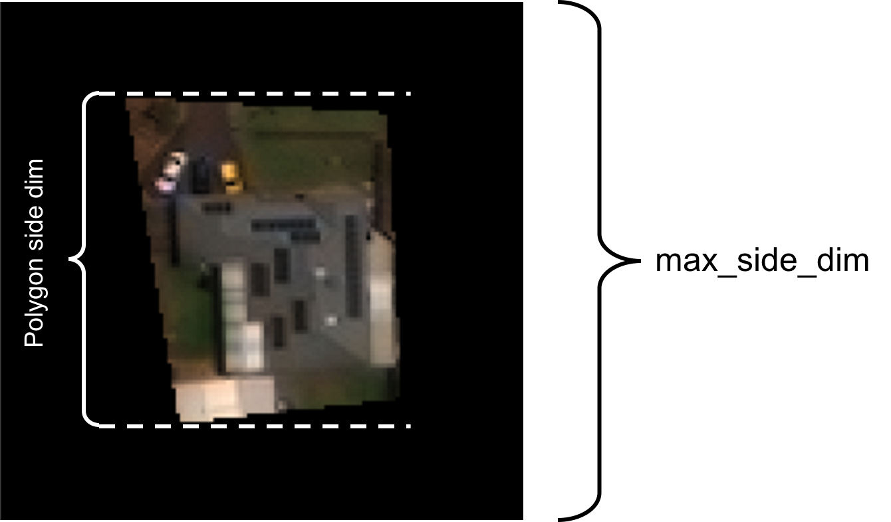

# train-cnn-classifier

Takes a GeoTiff image and labeled training polygons in a geojson file and produces a trained Convolutional Neural Network (CNN) classifier. The network architecture is [VGG Net](https://arxiv.org/pdf/1409.1556.pdf), which was developed as part of the [2014 ImageNet](http://www.image-net.org/challenges/LSVRC/2014/) challenge. See [here](https://github.com/DigitalGlobe/mltools/tree/master/examples/polygon_classify_cnn) for an example of a specific implementation of this network.



## Run

Here we execute an example in which a classifier is trained to find property polygons with pools. Training data is provided in the specified S3 location.

1. Within an iPython terminal create a GBDX interface an specify the task input location:

    ```python
    from gbdxtools import Interface
    from os.path import join
    import uuid

    gbdx = Interface()

    input_location = 's3://gbd-customer-data/58600248-2927-4523-b44b-5fec3d278c09/platform-stories/swimming-pools'
    ```

2. Create a task instance and set the required inputs:  

    ```python
    train_task = gbdx.Task('train-cnn-classifier')
    train_task.inputs.images = join(input_location, 'images')
    train_task.inputs.geojson = join(input_location, 'train_geojson')
    train_task.inputs.classes = 'No swimming pool, Swimming pool'
    ```

3. Set any optional hyper-parameters if necessary. With the following parameters training should take about three hours to complete:

    ```python
    train_task.inputs.two_rounds = 'True'
    train_task.inputs.nb_epoch = '30'
    train_task.inputs.nb_epoch_2 = '5'
    train_task.inputs.train_size = '4500'
    train_task.inputs.train_size_2 = '2500'
    train_task.inputs.test_size = '1000'
    train_task.inputs.bit_depth = '8'
    ```

4. Initialize a workflow and specify where to save the output:

    ```python
    train_wf = gbdx.Workflow([train_task])
    random_str = ''.join(random.choice(string.ascii_uppercase + string.digits) for _ in range(20))
    output_location = join('platform-stories/trial-runs', random_str)

    train_wf.savedata(train_task.outputs.trained_model, join(output_location, 'trained_model'))
    ```

5. Execute the workflow:  

    ```python
    train_wf.execute()
    ```

6. Track the status of the workflow as follows:

    ```python
    train_wf.status
    ```


## Input Ports

The task input ports. Note that booleans, integers and floats **must be** passed to the task as strings, e.g., 'True', '10', '0.001'.

| Name  | Default | Valid Values | Description:                                      |
|-------|---------|--------------|---------------------------------------------------|
| images | N/A | N/A | Contains GeoTiff image strip(s) from which to extract training polygons in geojson. The strips must be named after their catalog ids (ex- 1040010014BCA700.tif). Up to five image strips will be accepted as input. |
| geojson | N/A | N/A | Contains one geojson file with labeled training polygons. Each polygon should have an 'image_id' property containing the catalog id of the associated image strip, and a 'class_name' property with the appropriate training classifiction of the polygon. |
| classes  | N/A | String | String: classes to train network on, each separated by a comma (e.g- 'No swimming pool, Swimming pool'). Must be exactly as they appear in the class_name property of the polygon feature in the geojson. |
| [two_rounds](#two_rounds) | True | True, False | If True, train the network in two rounds- first on balanced classes then on the original distribution of classes. In the second training round only the weights of the final layer of the model will be updated. Recommended if there is class imbalance in the dataset. |
| [filter_geojson](#filter_geojson) | True | True, False | If True the task will remove any polygons that are larger than max_side_dim or smaller than min_side_dim from geojson. This is highly recommended as errors in training may occur if any polygons will be larger than the max_side_dim or smaller than min_side_dim. |
| [min_side_dim](#side-dimensions) | 10 | 0 - max_side_dim | The minimum acceptable side dimension (in pixels) for training polygons. |
| [max_side_dim](#side-dimensions)  | 125 | integer from 125 to 500 | The maximum acceptable side dimension (in pixels) for training polygons. |
| [train_size](#training-size) | 10000 | integer > 0 | Number of polygons to train the network on for the first round of training. |
| [train_size_2](#training-size)  | 0.5 * train_size | integer > 0 | Number of polygons to train on in the second round of training. Only relevant if two_rounds is True. |
| [batch_size](#batch-size)  | 32 | integer > 0 | Number of chips to train on per batch. |
| [nb_epoch](#nb_epoch) | 35 | integer > 1 | Number of training epochs to perform for the first round of training. |
| [nb_epoch_2](#nb_epoch) | 8 | integer > 1 | Number of training epochs to perform for the second round of training. Only relevant if two_rounds is True.|
| [test](#testing)  | True | True, False | If True testing will be completed on a subset of polygons. A test report with accuracy metrics will be saved as a text file in the 'model' output directory. |
| [test_size](#testing)  | 5000 | integer > 0 | Number of chips to test on. Only relevant if test is True. |
| [learning_rate](#learning-rate)  | 0.001 | float > 0 | Learning rate for the first round of training. |
| [learning_rate_2](#learning-rate)  | 0.01 | float > 0 | Learning rate for the second round of training (if applicable). |
| [bit_depth](#bit_depth)  | 8 | integer > 0 | Bit depth of the image strips in images. This parameter is necessary for proper normalization. |
| [use_lowest_val_loss](#use_lowest_val_loss)  | True | True, False | After the first round of training use the model weights that yielded the lowest validation loss (recommended). Otherwise the model weights after the final epoch will be used. |
| [kernel_size](#kernel_size) | 3 | integer > 1 | Side dimension (in pixels) of the kernels at each convolutional layer in the network. |
| [resize_dim](#resize_dim) | None | tuple (n_bands, rows < max_side_dim, cols < max_side_dim) | Dimensions to resize the chips to after padding. This should be smaller than the original dimension and have order (n_channels, side_dim, side_dim). |
| [small model] | False | Bool | Use a model with 8 layers instead of 16. Useful for large input images (>250 pixels). |


## Output Ports

train-cnn-classifier has one output directory port, trained_model. Its contents are listed in the following table:

| Name  | Description:                                      |
|-------|---------------------------------------------------|
| model_arch.json  | Architecture of the trained model stored as a json int the output folder. |
| model_weights.h5  | An h5py file containing the weights for the trained model. |
| model_weights  | This sub-directory will contain the model weights after each epoch of training. This allows you to load and test different models if necessary. |
| test_report.txt | Results of testing the model. If test was set to False in the inputs this file will not be in the output directory. |

## Advanced

This section contains additional information that provides further insight into training parameters and suggestions for training an effective model.

#### geojson

CNNs require ample training data for effective training. In addition to this, all image classes should be equally represented in the data fed to the network. Thus, you should have <i>at least</i> 2500 labeled polygons from each class in train.geojson. This file should also be as clean as possible (accurately labeled, legitimate polygons), your classifier will only be as good as the training data you feed it!

Below are more details on the optional hyper-parameter settings

#### two_rounds  

The two_rounds flag is a method for dealing with data that has natural class imbalance (unequal representation of image classes). Training a CNN on data with unbalanced classes often results in the network classifying all target data under the majority class. two_rounds avoids this by training in the following steps:  

1. Train the network on balanced data (the task will take care of creating a balanced training dataset).  
2. Retrain the network on the original class distribution to account for the probability of encountering a given image class. This round will only update the weights to the output layer of the network.



This two-round training process allows the network to learn to distinguish between classes based on distinct features (round one) and then learn the probability of encountering each class (round two). This is highly recommended for data that is not balanced.

#### filter_geojson

This flag will filter your geojson before training the network by removing any polygons that are larger than max_side_dim or smaller than min_side_dim. This is necessary if there are <i>any</i> polygons with side-dimensions larger than the value of [max_side_dim](#side-dimensions). You may do this before executing the task as follows:  

```python
from mltools import geojson_tools as gt
gt.filter_shapefile('input_file.geojson', 'output_filename.geojson', min_polygon_hw=min_side_dim, max_polygon_hw=max_side_dim)
```

#### side dimensions

Constraints on the minimum and maximum size (in pixels) of a polygon from geojson. Side dimensions are based on the size of polygons the bounding box (white line below).



A sample input chip is displayed above. Note that CNNs require all train/test inputs to have identical dimensions. Thus, all polygons are zero-padded to the following dimensions: (num_bands, max_side_dim, max_side_dim). This means that any polygons that have a side dimension larger than max_side_dim cannot be used and will throw an error during training. Use the [filter_geojson](#filter_geojson) flag to avoid this.

#### training size

Number of polygons to train on. If the provided geojson does not have enough polygons the task will throw an error.

Notice that if training takes place in [two_rounds](#two-rounds), the maximum train size will be as follows: size of smallest class * number of classes, assuming no polygons are removed in the [filter_geojson](#filter_geojson) step. Additionally if [testing](#testing) is performed the test data will be subtracted from the available training polygons.

#### batch size

Number of polygons to train on per batch. The model weights will be updated following each batch. Smaller batch sizes can help avoid local minima by increasing the amount of noise in the gradient.

#### nb_epoch

Number of training epochs to complete. The validation loss tends to decrease with each successive epoch until a minimum loss is reached. At this point any additional training epochs may result in overfitting.

#### use_lowest_val_loss

While the validation loss of the model tends to decrease with successive training epochs, it rarely does so monotonically. Furthermore, if too many training epochs are completed the model may begin to overfit, causing the validation loss to increase with successive epochs. The loss may therefore not be at a minimum at the end of training. Use this flag to ensure that the initial round returns a model with the lowest possible validation loss.

Note that all model weights will be returned in the model_weights folder of the output directory.

#### testing

Testing should only be done on two-class classifications. The following explanations assume the classes are input to the task as follows: 'Negative class, Positive class'.

If the test flag is set to True, the task will put aside a set of polygons from geojson to get accuracy metrics for the trained model. Set this to False if you would like to complete testing manually.

The following metrics are provided in test results:
* False Positives: number of polygons falsely classified as Positive class
* False Negatives: number of polygons falsely classified as Negative class
* Precision: True Positives / (True Positives + False Positives)
* Recall: True Positives / (True Positives + False Negatives)
* Accuracy: Number of correctly classified polygons / test_size

#### kernel_size

Each convolutional layer of a CNN uses kernels to extract features from the input image to create an output feature map that is passed to the next layer. This parameter specifies the side dimension of these kernels to use to train the network. Note that increasing the kernel size will slow down training dramatically. Finding the ideal kernel size for a specific use case is often a matter of trial and error.

#### resize_dim

There may be memory errors when the input chips are too large (over 200px). This argument will downsample the input images to the input dimensions. Input should be as follows: (n_bands, rows, cols). The value of n_bands should be equal to the number of bands of the input imagery since only the side dimensions will be updated.

## Development

### Build the Docker Image

You need to install [Docker](https://docs.docker.com/engine/installation/).

Clone the repository:

```bash
git clone https://github.com/platformstories/train-cnn-chip-classifier
```

Then:

```bash
cd train-cnn-classifier
docker build -t train-cnn-classifier .
```

### Try out locally

Create a container in interactive mode and mount the sample input under `/mnt/work/input/`:

```bash
docker run -v full/path/to/sample-input:/mnt/work/input -it train-cnn-classifier
```

Then, within the container:

```bash
python /train-cnn-classifier.py
```

Watch the stdout to confirm that the model is being trained.


### Docker Hub

Login to Docker Hub:
```bash
docker login
```

Tag your image using your username and push it to DockerHub:

```bash
docker tag train-cnn-classifier yourusername/train-cnn-classifier
docker push yourusername/train-cnn-classifier
```

The image name should be the same as the image name under containerDescriptors in train-cnn-classifier.json.

Alternatively, you can link this repository to a [Docker automated build](https://docs.docker.com/docker-hub/builds/). Every time you push a change to the repository, the Docker image gets automatically updated.


### Register on GBDX

In a Python terminal:

```python
from gbdxtools import Interface
gbdx = Interface()
gbdx.task_registry.register(json_filename='train-cnn-classifier.json')
```

Note: If you change the task image, you need to reregister the task with a higher version number in order for the new image to take effect. Keep this in mind especially if you use Docker automated build.
